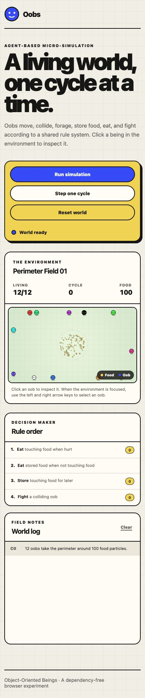
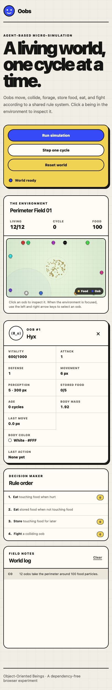

# Oobs

Oobs is a dependency-free browser simulation of small autonomous beings living
inside a shared 2D environment. Each Oob perceives, explores, moves, collides,
forages, stores food, eats, and fights according to the same ordered rule
system.



## Simulation

- 12 Oobs begin at random, non-overlapping positions around the perimeter.
- Every Oob has a unique face and one color from a 12-color palette containing
  white, black, and ten evenly spaced spectrum colors.
- 100 food particles begin near the center of the environment.
- Movement is randomly assigned from 1–10 pixels per cycle.
- Perception is randomly assigned from 1–10, with each point representing a
  60-pixel sensing radius.
- An Oob that cannot perceive food or another Oob explores using persistent,
  distant waypoints and selects a new route after arriving or becoming stuck.
- Vitality uses a 1000-point scale. Oobs begin with 600–1000 vitality and lose
  exactly 1 point to time at the start of every cycle.
- Circular collision physics keep Oobs inside the environment and prevent
  bodies from passing through one another.

## Inspecting an Oob

Oob details remain hidden until an Oob is selected. Click a body in the
environment, or focus the environment and use the left and right arrow keys.
The dashed circle shows the selected Oob's current perception radius.



The inspector reports vitality, attack, defense, movement, perception, stored
food, age, body mass, last movement, body color, and last action. Press Escape
or use the close button to dismiss it.

## Rules and cycles

Each living Oob loses 1 vitality to time, then receives one turn per cycle. A
turn can contain one action and movement up to that Oob's movement limit.
Actions are selected in this order:

1. Eat touching food when hurt.
2. Eat stored food when sufficiently hurt and not touching fresh food.
3. Store touching food when storage is available.
4. Fight a colliding Oob.

Eating and fighting require physical contact. Perception only determines what
an Oob can sense and move toward; it does not bypass collision requirements.

## Controls

- **Run simulation** starts or pauses automatic cycles.
- **Step one cycle** advances the world once while paused.
- **Reset world** creates a fresh population and food field.
- **Clear** removes entries from the world log.
- **Click an Oob** opens its inspector and perception visualization.
- **Left/Right Arrow** changes the selected Oob while the environment is
  focused.
- **Escape** closes the inspector.

## Run locally

No build process or package installation is required. From the project folder,
start any static HTTP server. For example:

```sh
python3 -m http.server 8765 --bind 127.0.0.1
```

Then open [http://127.0.0.1:8765/](http://127.0.0.1:8765/).

## Project structure

```text
oobs/
├── index.html
├── css/
│   └── styles.css
├── js/
│   ├── app.js          Interface controls and rendering updates
│   ├── graphics.js     Canvas graphics and perception visualization
│   ├── physics.js      Movement, collision, and perception queries
│   ├── rules.js        Ordered action rules
│   └── simulation.js   World, Oobs, food, cycles, and exploration
└── assets/
    ├── oob-mark.svg
    └── screenshots/
```

## Technology

The project uses semantic HTML, modern CSS, native JavaScript modules, and the
Canvas 2D API. It has no runtime libraries, frameworks, package manager, or
generated build artifacts.
